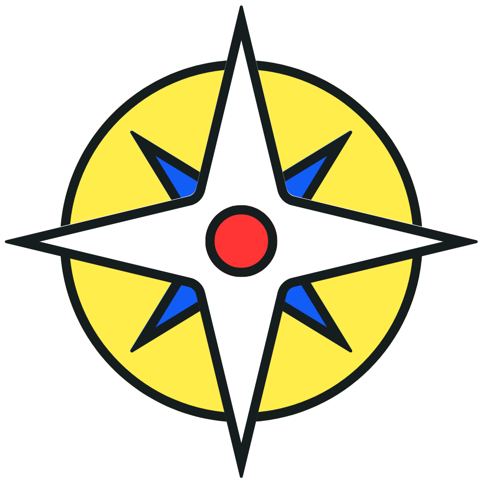

# **Lakbay: Discover Hidden Gems Across the Philippines**

## *The Website*

### Overview

**Lakbay** is a travel and culture website which showcases uncommon destinations, local traditions, and enjoyable experiences across the Philippine Islands. We designed it to help users explore the real beauty of Filipino heritage while promoting sustainable and community-based tourism.

Visitors can browse carefully chosen travel guides, learn about some local festivals, and plan trips with interactive maps. Whether you're a weekend warrior or a cultural enthusiast, Lakbay lets you plan and adventure on your screen.

---

### Logo Concept

The logo is inspired by the Philippine flag. It features a yellow sun in the center, a blue star, a white star, and a small red circle at the center; their colors are also based on the colors of the national flag. The elements combined resemble a compass as it guides the users on planning their vacation. 
  

---

### Website Structure

| Page Title         | Description |
|--------------------|-------------|
| **Home**           | Welcome page with featured destinations |
| **Destinations**   | Interactive map and region-based listings of tourist spots with photos and descriptions. |
| **Culture & Traditions** | Descriptions about local traditions, dances, and indigenous practices. |
| **Travel Planner** | Has a calculator which computes the needed budget for trips. |
| **About Us**       | Mission, team, and contact information. |
| **Sources** | Citations |

---

### JavaScript Integration

- **Travel Planner Page**: A calculator where you input certain travel expenses and will output the total cost of the trip.
- **Destinations Page**: Interactive map with clickable regions and pop-up info cards.

---

### Wireframe Mockups 
- ([Canva Link](https://www.canva.com/design/DAG3LDOXUkI/ixpo-hTWTPzFFcBfEbgSTQ/edit?utm_content=DAG3LDOXUkI&utm_campaign=designshare&utm_medium=link2&utm_source=sharebutton))

 

## *HTML Form Integration*
### Purpose
- **Sign up & Log in** to enter the website and access your data.
- **Add Travel Wishlist** or select provinces they would like to visit.
- **User Thoughts and Feedback** about the destinations or the website itself.

### New Webpages
1. User Access Portal
    - Title: Lakbay
    - Purpose: Collect user name, email, password, and travel preferences
2. Travel Wishlist
    - Title: Wishlist | Lakbay
    - Purpose: User selects provinces/attractions they would like to visit or they would just like to add
3. User Thoughts
    - Title: Thoughts & Feedback | Lakbay
    - Purpose: Stores thoughts of user about destinations or even the website itself. Users can also send their feedbacks to an email included in the webpage

### Wireframes Overview
- ([Canva Link]https://www.canva.com/design/DAG3LDOXUkI/ixpo-hTWTPzFFcBfEbgSTQ/edit?ui=eyJEIjp7IlQiOnsiQSI6IlBCNzM3cGM1YlE5MHFZeGoifX19))

